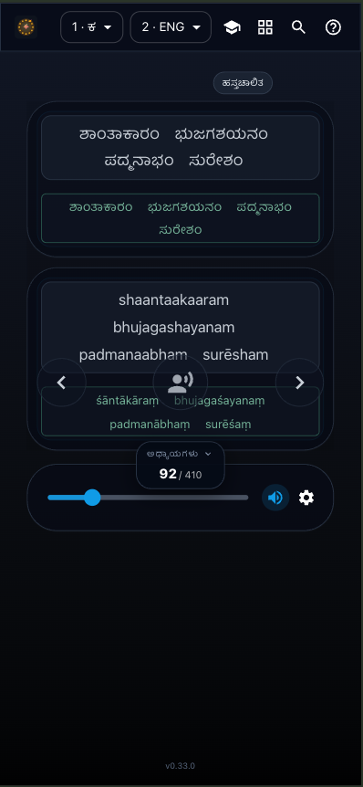
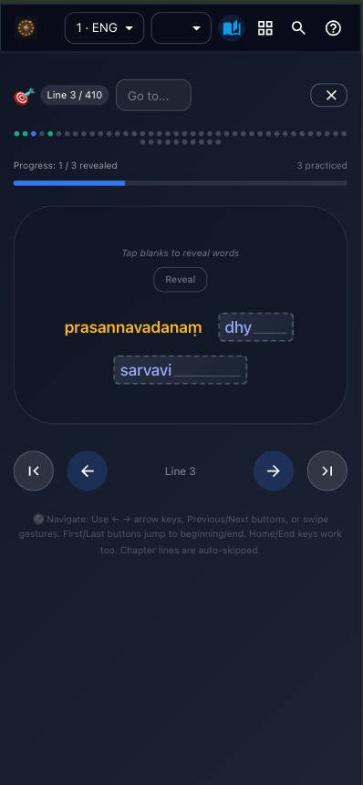
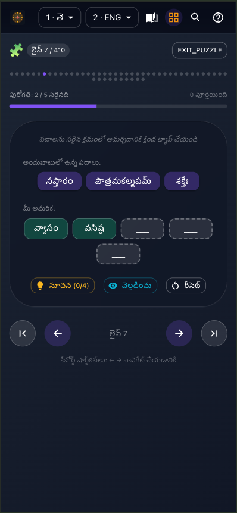

# Avabodhak - Stotra Maala

A friedly UX to learn adn practice sacred texts and stotras (Vishnu Sahasranama, Sri Hari Stotram, Keshava Nama) with segmented word flow, search, pronunciation help, and dual-mode TTS.

## Tech
- React 18 + TypeScript, Vite 5
- Tailwind CSS 3
- Vitest + Testing Library

## Run locally
Requirements: Node.js ≥ 18, npm.

```bash
npm install

# Optional: copy env and enable features as needed
cp .env.example .env

# Start app + local TTS dev server
npm run dev
```

App: http://localhost:5173

## Text-to-speech
- **Two TTS modes** with mutual exclusivity:
  - **Line TTS** (center mic button): Plays entire line at once
  - **Paced TTS** (timeline play button): Word-by-word with adjustable pace (80-150 WPM)
- Frontend calls `POST /api/tts` (see `src/lib/tts.ts`).
- Dev: Node TTS server (`scripts/tts-server.js`) on `TTS_PORT` (default 8081).
- Feature flag: set `VITE_FEATURE_TTS=true` in `.env`.
- **TTS-supported languages**: `deva` (Hindi), `knda` (Kannada), `tel` (Telugu), `tam` (Tamil)
- UI languages: `deva`, `knda`, `tel`, `tam`, `iast` (English), `guj`, `pan`

## Build & deploy
```bash
npm run build
npm run preview
```

- Output: static files in `dist/`.

## Credits
- Vishnu Sahasranama, Sri Hari Stotram and Keshava Nama translations credits solely belong to [vignanam.org](https://vignanam.org/)
- Avabodhak is a personal project and was made to learn and practice these texts. There is no commercial intent.

## Screenshots

### Read Mode



### Practice Mode



### Puzzle Mode

